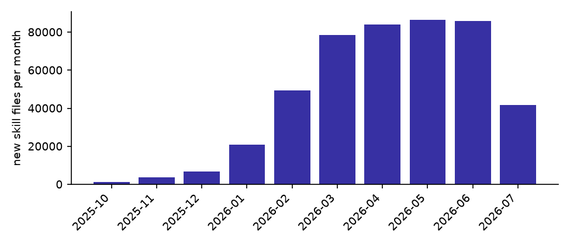
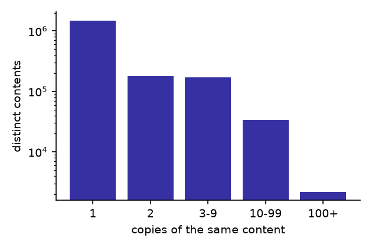
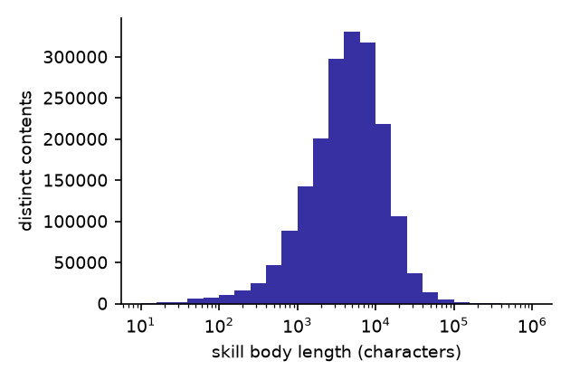

# GitSkills — sample for the MSR 2027 Mining Challenge proposal

An **Agent Skill** is a folder containing a `SKILL.md` file with
instructions for a language-model agent, optionally accompanied by
scripts and reference documents. Anthropic introduced the format in
October 2025 as an open specification. GitSkills is a dataset of the
`SKILL.md` files publicly visible on GitHub in July 2026: 3,797,117
files from 282,200 repositories, in a single self-contained SQLite
database.

This repository holds a **sample** of the dataset for the MSR 2027
Mining Challenge organizing committee. Upon acceptance, the full
dataset will be archived on Zenodo with a DOI and mirrored on Hugging
Face.

## Authors

- Giuseppe Destefanis — University College London, United Kingdom (g.destefanis@ucl.ac.uk)
- Daniel Graziotin — University of Hohenheim, Germany (graziotin@uni-hohenheim.de)
- Matteo Vaccargiu — University of Hohenheim, Germany (matteo.vaccargiu@uni-hohenheim.de)
- Marco Ortu — University of Cagliari, Italy (marco.ortu@unica.it)

## Quick start

```
unzip agent_skills_sample.zip
sqlite3 agent_skills_sample.db "SELECT COUNT(*) FROM artifacts;"
```

No server, no credentials; any SQLite client works.

## Sample vs full dataset

| | Sample | Full dataset |
|---|---:|---:|
| File occurrences (`artifacts`) | 29,786 | 3,797,117 |
| Distinct skill contents | 13,000 | 1,877,981 |
| Repositories | 11,841 | 282,200 |
| Repository owners | 10,786 | 195,841 |
| Bundled files (`artifact_siblings`) | 47,829 | 7,264,865 |
| Bundled files with text | 22,278 | 3,497,752 |
| Commit histories | 3,010 | 458,548 |
| SQLite file size | 277 MB | 41 GB |

The sample is drawn deterministically: the 13,000 distinct contents
with the lowest content hashes (uniform in practice, reproducible at
any time), together with **every** row the full dataset holds about
them — all copies across repositories, the metadata of every
repository involved, all bundled files, and all history rows. The
sample therefore has the same schema and the same invariants as the
full dataset: every content group is complete and has exactly one
representative carrying the text. Queries written against the sample
run unchanged on the full dataset.

## Schema

Four tables. Every string is UTF-8; timestamps are ISO-8601 UTC.

### `artifacts` — one row per file occurrence

| Column | Meaning |
|---|---|
| `repo_full_name`, `path` | where the file lives (primary key) |
| `filename` | exact basename as returned by code search (case preserved) |
| `location_class` | `canonical` (`.claude/skills/<name>/SKILL.md`), `skills-dir` (under a `skills/` directory), or `other` |
| `file_sha` | git blob hash of the content; identical hash = identical bytes |
| `discovered_at` | when the collection run recorded the file |
| `dedup_primary` | 1 for the one representative of each distinct content |
| `content` | full text (representatives only) |
| `content_fetched`, `content_sha_ok` | retrieval bookkeeping; `content_sha_ok` = 1 when the downloaded bytes reproduce `file_sha`, 2 when repaired via the blob API |
| `frontmatter_valid`, `name`, `description`, `body_chars` | parsed YAML front matter and body length |
| `sibling_count`, `sibling_bytes`, `has_scripts`, `has_references` | folder composition summary (representatives only) |
| `composition_fetched`, `composition_truncated` | bookkeeping; `composition_truncated` = 1 flags folders larger than the listing cap (some repositories hold tens of thousands of skills) |
| `first_commit_at`, `last_commit_at`, `commit_count` | commit history of the file at its current path (sampled rows only) |
| `first_commit_author`, `last_commit_author` | anonymised author codes (see below); bots keep their login |
| `first_commit_author_type`, `last_commit_author_type` | `User`, `Bot`, `Organization`, or empty when the commit has no linked GitHub account |
| `first_commit_message`, `last_commit_message` | commit messages with emails and personal names masked |
| `history_fetched` | bookkeeping for the history sample |

### `repos` — one row per repository

`full_name`, `owner`, `stars`, `forks`, `is_fork`, `language`,
`license`, `description` (emails masked), `created_at`, `pushed_at`,
`metadata_fetched`.

### `artifact_siblings` — files bundled with a representative skill

`repo_full_name`, `artifact_path` (joins to `artifacts`),
`entry_name`, `entry_type` (`file`/`dir`), `entry_size`, `entry_sha`,
`content` (text files up to 100 KB), `content_fetched`,
`skipped_reason` (binary, oversize, or folder above the listing cap).

### `mining_runs` — collection provenance

One row per collection run: query, start and end timestamps, result
count.

## How the data was collected

Collection ran in July 2026, read-only, against the GitHub code-search
API, the REST and GraphQL APIs, and the raw-content CDN. Code search
caps every query at 1,000 results and its reported total proved
unreliable — it estimated roughly 349,000 matches for the filename
query, against the 3.8M files actually retrieved — so discovery
partitioned the search space by file size until every range could be
retrieved completely. Files were then grouped by content hash; one
representative per group was enriched with content (hash-verified
against the git blob), front matter, folder composition, repository
metadata, and sampled commit history. Files deleted from GitHub
between discovery and content retrieval (0.9% of distinct contents)
are excluded.

## Anonymisation

- Commit author accounts are replaced by keyed one-way codes,
  identical for the same account throughout, so authorship can be
  traced across skills and repositories without identifying anyone.
  The key is not distributed. Accounts of type `Bot` keep their login.
- Email addresses (including GitHub noreply addresses) and personal
  names in commit messages are masked with a fixed marker; names of AI
  assistants in `Co-authored-by` trailers are kept. A scan of the
  released file confirmed no email addresses remain in commit messages
  or repository descriptions.
- File contents are reproduced byte-for-byte as published on GitHub,
  so every content row still verifies against its git blob hash.

## Descriptive statistics

All figures below are for the full dataset.

- **Location.** 373,652 files (9.8%) sit at the canonical
  `.claude/skills/` path, 2,102,053 (55.4%) under some `skills/`
  directory, 1,321,412 (34.8%) elsewhere.
- **Duplication.** 50.5% of all file occurrences are verbatim copies
  of another file. The most copied contents appear in hundreds of
  repositories each.
- **Front matter.** 1,625,701 distinct contents (86.6%) carry valid
  YAML front matter; the rest are malformed or predate the format.
- **Repositories.** Top languages: Python (71,801 repositories),
  TypeScript (67,104), JavaScript (23,938), Shell (19,780), HTML
  (12,187), Rust (8,371), Go (8,094). 11,431 repositories have 100+
  stars. Only 3 are forks — GitHub indexes a fork only when it has
  more stars than its parent.
- **Before the format.** The earliest first commit dates from 2014:
  the filename match also returns lowercase `skill.md` files and
  similar names that predate the October 2025 specification. Each row
  carries the exact basename, location class, and front-matter
  validity, so stricter populations can be defined at analysis time.

## Three views of the full dataset

New skill files per month since the format's introduction in October
2025, dated by the first commit of the 458,548 files with history.
Dates follow the file's current path, so renamed files appear late;
July 2026 covers only the collection window.



Distinct contents by number of verbatim copies (log scale): a long
tail of singletons and a head of mass-copied contents.



Body length of the 1.88M distinct skills (log scale): most skills are
between one and ten thousand characters of instructions.



## Known limitations

- GitHub code search indexes default branches only, files under
  384 KB, recently active repositories with fewer than 500,000 files,
  and forks only when more starred than the parent. The dataset is a
  lower bound on the population.
- The dataset is a point-in-time snapshot (July 2026).
- Commit history follows the file's **current** path: for a renamed
  file, `first_commit_at` dates the rename and `commit_count` covers
  the current path only.
- History is collected for every skill in a standard location plus a
  size-stratified sample of the rest; `history_fetched` marks which
  rows.
- Folder composition and history describe the representative's
  repository only; other copies of the same content may differ.
- A small class of skills are symlinks; their content is the link
  target path rather than instructions.

## Example queries

Most copied skill contents in the sample:

```sql
SELECT MAX(name) AS name, COUNT(*) AS copies
FROM artifacts
GROUP BY file_sha
ORDER BY copies DESC LIMIT 10;
```

Skill counts by location class:

```sql
SELECT location_class, COUNT(*) AS files
FROM artifacts
GROUP BY location_class
ORDER BY files DESC;
```

Bundled files of skills that ship more than two of them:

```sql
SELECT s.entry_name, s.entry_type, s.entry_size
FROM artifact_siblings s
JOIN artifacts a ON a.repo_full_name = s.repo_full_name
                AND a.path = s.artifact_path
WHERE a.dedup_primary = 1 AND a.sibling_count > 2
LIMIT 10;
```

Skill count by repository language:

```sql
SELECT r.language, COUNT(*) AS skills
FROM artifacts a JOIN repos r ON r.full_name = a.repo_full_name
GROUP BY r.language
ORDER BY skills DESC LIMIT 10;
```
